# BKN RCC Spun Pipes — Firestore Database Documentation

> Reverse-engineered from the actual codebase (`index.html`). The app is a single-file
> browser PWA talking directly to Firebase Firestore with the compat SDK — **no backend
> server, no Cloud Functions, no Firebase Storage.** The Kunigal poles app (`poles/index.html`)
> is a structurally identical mirror in a **separate Firebase project**, with every
> collection name prefixed `poles_` (`COL_PREFIX = 'poles_'`).

---

## 1. Data model at a glance

- **Storage engine:** Cloud Firestore (native mode), region `asia-south1` (Mumbai).
- **Shape:** 12 flat top-level data collections + 1 `meta` collection of singleton config documents.
- **No sub-collections.** No document references. Relationships are by **string value** (staff name, customer name, pipe-type label).
- **Heavily denormalized:** orders embed a `pipes{}` map and a `payments[]` array; invoices/quotations embed `items[]`; materials embed `payments[]`. There are no joins.
- **Access pattern:** on launch the app does one `getAll()` (`.get()`) per collection in parallel, then attaches a **real-time `onSnapshot` listener to every collection**. All filtering, sorting and aggregation happen **client-side in JavaScript** over in-memory arrays (`cache`). The code uses **no `.where()` / `.orderBy()`** and a single `.limit()` — the database is effectively used as a synced document store, not a query engine.
- **Offline:** `enablePersistence({synchronizeTabs:true})` — full offline read/write with local IndexedDB cache.
- **Auth:** Firebase Email/Password; security rules gate all access to authenticated users.

---

## 2. Collections

### 2.1 `orders`  — customer sales orders (the core collection)
| Field | Type | Notes |
|---|---|---|
| `customer` | string | free text; **no customer collection** (see relationships) |
| `phone` | string | may hold comma-separated numbers |
| `orderDate` | string `YYYY-MM-DD` | |
| `deliveryDate` | string `YYYY-MM-DD` | drives the Schedule calendar |
| `address` | string | village name; matched to embedded village directory (fuzzy) |
| `route` | string | dispatch grouping key (free text, e.g. "turuvekere route") |
| `km` | number | distance from Tiptur |
| `total`, `advance`, `balance` | number | balance = total − advance − Σpayments |
| `paymentMode` | string | 'Cash' default |
| `pipes` | map `{ "300mm NP2": qty, … }` | **embedded** |
| `payments` | array `[{date, amount, note}]` | **embedded** interim payments |
| `status` | string | `pending` → `ready` → `delivered` |
| `paid` | bool | |
| `notes` | string | |

- **Purpose:** sales lifecycle from order → production-ready → dispatched/delivered.
- **Queried in JS by:** `status`, `deliveryDate`, `route`, `address`, `customer`, `orderDate`.
- **Growth:** highest-volume collection, ≈ **5,000 docs/year**.

### 2.2 `production` — daily pipe production log
`{ date, pipes{}, rejects{}, notes }` — `pipes`/`rejects` are per-type qty maps. ~300–1,000 docs/yr. Queried by `date`.

### 2.3 `attendance` — staff daily attendance
`{ staff, date, present }` — **batch-written** (`firestoreDb.batch()`) one doc per staff per day. Queried by `staff`, `date`, weekday. Growth = staff × working days (~few thousand/yr).

### 2.4 `advances` — staff salary advances
`{ date, staff, amount, note }`. Editable (staff can be reassigned). Queried by `staff`, date range.

### 2.5 `materials` — raw material purchases (cement, M-sand, 20mm, wire, jelly)
Two shapes:
- single item: `{ date, material, qty, rate, totalAmt, supplier, note, payments[] }`
- steel wire: `{ date, material:'steel_wire', sizes{}, totalAmt, supplier, note, payments[] }`

`payments[]` embedded (supplier part-payments). Queried by `material`, `supplier`, `date`.

### 2.6 `expenses` — general business expenses
`{ category, amount, date, note }`. Queried by `category`, month.

### 2.7 `labour_karchi` — Jharkhand labour payments
`{ date, amount, type, note }` (`type`: karchi / partial / settlement). Date-range queried.

### 2.8 `salary_payments` — staff salary disbursements
`{ staff, month, amount, date, note }`. Queried by `staff` + `month`.

### 2.9 `shop_expenses` — supplier/shop purchases
`{ date, supplier, category, item, description, amount }` (written with `.add()`). Queried by `supplier`, month.

### 2.10 `shop_payments` — payments to shops/suppliers
`{ date, amount, note }` (written with `.add()`). Date-range queried.

### 2.11 `gst_invoices` — GST tax invoices
`{ invoiceNo, invoiceDate, customer, customerAddress, customerGSTIN, supplyType, gstRate, items[], taxableTotal, cgst, sgst, igst, gstAmount, grandTotal }`. `items[]` embedded line items. Queried by financial year, month, invoiceNo. Invoice number series `BNB/<FY>/NNN`.

### 2.12 `quotations` — price quotations
`{ quotationNo, date, customer, address, phone, validUntil, items[], total, notes }`. `items[]` embedded.

### 2.13 `meta` — singleton configuration documents
One fixed-id document each; small, read-heavy, rarely written:

| Doc id | Contents |
|---|---|
| `pipe_rates` | per-type sale rate |
| `piecerate` | per-type piecework labour rate |
| `consume_rates` | material consumption per pipe |
| `pipe_opening` / `mat_opening` | opening stock |
| `pipe_stock_thresholds` / `mat_stock_thresholds` | low-stock alerts |
| `staff_config` | staff name list |
| `staff_pay_config` | `{ config:{name:{salary,salaryDay}}, foodPerDay }` (real-time listener) |
| `gst_profile` | seller GSTIN, address, phone, bank details |
| `dispatch_assign` | route → driver map |

---

## 3. Relationships (Mermaid)

Relationships are **logical, by string value** — Firestore stores no references or foreign keys.

```mermaid
erDiagram
    orders ||--o{ payments_embedded : "embeds []"
    orders }o--|| PIPE_TYPES : "pipes{} keys (const)"
    orders }o--o| meta_pipe_rates : "priced by"
    orders }o--o| meta_dispatch_assign : "route→driver"
    orders }o--o| village_directory : "address matched (embedded const)"

    production }o--|| PIPE_TYPES : "pipes/rejects keys"
    production }o--o| meta_piecerate : "labour cost"
    production }o--o| meta_consume_rates : "material used"

    attendance }o--|| STAFF : "staff (const + meta.staff_config)"
    advances }o--|| STAFF : "staff"
    salary_payments }o--|| STAFF : "staff"
    attendance }o--o| meta_staff_pay_config : "salary/food"

    materials }o--o| suppliers_string : "supplier (string)"
    materials ||--o{ mat_payments_embedded : "embeds []"
    shop_expenses }o--o| suppliers_string : "supplier (string)"

    gst_invoices ||--o{ invoice_items : "embeds items[]"
    quotations ||--o{ quote_items : "embeds items[]"
    gst_invoices }o--o| meta_gst_profile : "seller profile"

    meta_pipe_rates }|..|{ meta : "doc in"
    meta_piecerate }|..|{ meta : "doc in"
    meta_staff_pay_config }|..|{ meta : "doc in"
    meta_gst_profile }|..|{ meta : "doc in"
    meta_dispatch_assign }|..|{ meta : "doc in"
```



**Key point:** `STAFF`, `PIPE_TYPES` and the 819-village directory are **hardcoded JS constants**, not collections. `customer` and `supplier` are free-text strings with **no master collection** — the single biggest normalization gap.

---

## 4. Read / write patterns

| Aspect | Reality in code |
|---|---|
| **Initial load** | `Promise.all([...12 × getAll(), meta docs])` — full-collection `.get()` of everything, once. |
| **Live sync** | `onSnapshot` listener on **all 12 collections** + `meta/staff_pay_config`. Any change re-runs `goto(currentPage,true)` to re-render. |
| **Writes** | `doc(id).set()` / `.update()` / `.delete()`; `.add()` for shop_*; `batch()` for attendance & bulk salary. |
| **Queries** | None server-side. **All filtering/sorting/aggregation is client-side JS** over `cache.*` arrays. |
| **Reactivity** | 12 listeners → 12 re-render hooks; changes propagate instantly across devices/tabs. |

### Query efficiency
- **Pro:** with everything cached in memory, all "queries" are O(n) array scans — instant at this data scale, zero query latency.
- **Con:** the app must **download whole collections** to answer anything. There is no server-side narrowing (no date-range, no status filter, no pagination). Offline persistence means cold re-opens read only *changed* docs, so day-to-day cost stays low; but a fresh device / cleared cache re-reads everything.

### N+1 reads
**None.** Because collections are loaded wholesale and joins are done in memory over embedded data, there is no per-item follow-up read. Denormalization (embedded `pipes/payments/items`) deliberately avoids N+1.

### Duplicate data / denormalization
- Deliberate embedding: `orders.pipes`, `orders.payments`, `materials.payments`, `gst_invoices.items`, `quotations.items`.
- `orders.balance` is a **stored computed field** (total − advance − Σpayments) — duplication that must be kept consistent on every payment write (it is, in `savePayment`/`saveCollect`).
- Customer & supplier names are duplicated as raw strings across many docs (no master record) — the main uncontrolled duplication.

---

## 5. Indexes

- **Composite indexes required: none.** The app issues no compound `where`/`orderBy` queries, so Firestore's automatic single-field indexes fully cover it.
- **Missing indexes: none needed today.** If the app were refactored to push filtering server-side (recommended for scale — e.g. `orders where deliveryDate >= X order by deliveryDate`), it would then need composite indexes such as `(status, deliveryDate)`, `(status, route)`, `(customer, orderDate)`.

---

## 6. Cost, scalability, expensive queries

- **Free tier headroom:** at ~5,000 orders/yr the whole dataset is a few MB/yr against the 1 GB free limit — storage is a non-issue for ~150+ years. Daily reads stay well under the 50k/day free quota because offline persistence serves re-opens from cache and bills only deltas.
- **Expensive pattern:** the *only* cost risk is the **full-collection cold read**. On a new device, cleared browser data, or many distinct users opening fresh sessions, the app reads every document in every collection. Multiplied across users/devices and years of accumulated `orders`, this is the one line item that grows.
- **Mitigation path (when needed, in ~3–5 yrs):** load only the last N months by default with a server-side date-range query + pagination; keep old data queryable on demand. This caps reads regardless of history size.

---

## 7. Offline, real-time, security, auth, functions, storage, backup

- **Offline support:** ✅ `enablePersistence({synchronizeTabs:true})` — the app is fully usable offline; writes queue and sync on reconnect (critical for a factory with patchy mobile data).
- **Real-time listeners:** ✅ 12 collection listeners + 1 meta doc listener; multi-device/multi-tab live sync.
- **Security rules (in Firebase console, not in repo):**
  ```
  rules_version = '2';
  service cloud.firestore {
    match /databases/{database}/documents {
      match /{document=**} { allow read, write: if request.auth != null; }
    }
  }
  ```
  Authenticated-users-only, all-or-nothing. Any signed-in user has full read/write to everything — no per-collection, per-field, or role-based restriction.
- **Authentication:** Firebase Email/Password; `onAuthStateChanged` gates the app; users provisioned manually in the Firebase console. Firebase config is embedded client-side (normal for Firebase — security rests entirely on the rules).
- **Cloud Functions:** ❌ none.
- **Firebase Storage:** ❌ none — website/app images live on Hostinger & GitHub, not Firebase.
- **Backup:** ❌ no automated backup configured. Mitigations present: (a) offline IndexedDB copy on each device, (b) CSV/Excel export buttons throughout the app for manual backups. **Recommended:** enable scheduled Firestore export to a GCS bucket (or periodic manual export).

---

## 8. Should any collections merge or split?

- **Keep separate:** the 12 collections map cleanly to distinct entities and write cadences — no forced merges.
- **Candidate merge:** `shop_expenses` + `expenses` overlap conceptually (both are outgoing spend); kept apart because suppliers/shops carry extra fields (`supplier`, `item`, `description`) and their own payment ledger. Reasonable as-is.
- **Candidate split/extract (normalization):** introduce **`customers`** and **`suppliers`** master collections. Today both are free-text strings duplicated across orders/invoices/materials — the root cause of spelling-variant fragmentation (already worked around with fuzzy matching for villages). A `customers` collection would enable a clean account ledger, dedupe, and phone-based identity.
- **`meta`** is correctly a bag of singletons — fine.

---

## 9. Architecture scorecard

| Category | Score | Rationale |
|---|---:|---|
| **Scalability** | **6 / 10** | Perfect for one factory for many years; but the load-everything, no-pagination, no-server-query pattern caps ultimate scale and would need a date-range/pagination refactor before large growth or multi-tenant use. |
| **Performance** | **7 / 10** | In-memory arrays → instant filtering/sorting and live multi-device sync; offline-first. Cost is cold-load latency once collections grow large (mitigated by persistence). |
| **Cost efficiency** | **8 / 10** | Stays in the free tier for years; offline persistence minimizes billed reads; no Functions/Storage spend. Only long-term risk is full-collection cold reads. |
| **Security** | **6 / 10** | Auth + authenticated-only rules is adequate for a small trusted team, and separate projects isolate pipes vs poles. But all-or-nothing rules (no roles/field-level control) and no rules-in-repo/versioning are real gaps for growth. |
| **Maintainability** | **7 / 10** | Flat model, no migrations, no joins, easy to reason about; single-file app and CSV exports help. Held back by string-keyed relationships (typo/dup risk), hardcoded `STAFF`/`PIPE_TYPES`, and a large single HTML file. |

**Overall: ~6.8 / 10** — an excellent *pragmatic* fit for a single-factory ERP: cheap, offline-first, real-time, and simple. The deliberate "sync-everything, compute-in-JS" design trades theoretical scalability for simplicity and near-zero cost, which is the right call at this size. The highest-value improvements, in order: (1) automated Firestore backups, (2) `customers`/`suppliers` master collections, (3) server-side date-range loading + pagination for `orders` before the dataset gets large, (4) role-scoped security rules if non-owner staff ever get logins.
